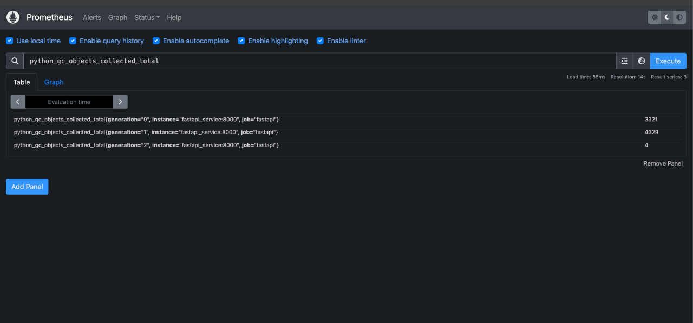
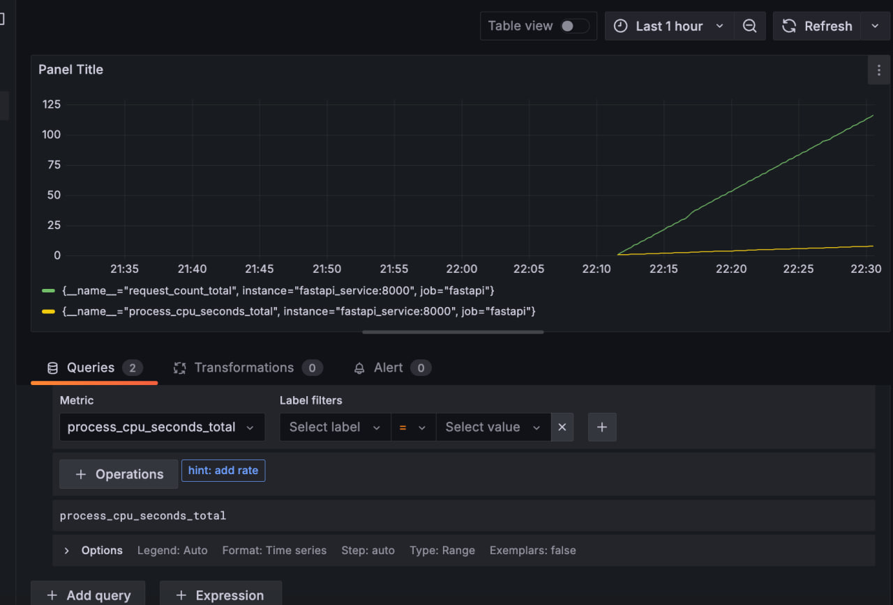
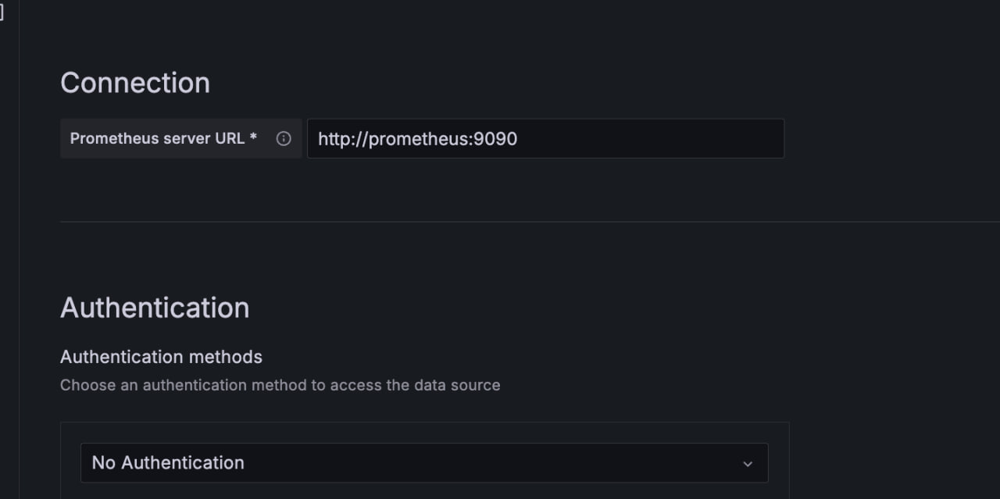

```markdown
# Проект: FastAPI, Prometheus и Grafana

Этот проект представляет собой веб-сервис, разработанный на основе FastAPI, с интеграцией метрик с помощью Prometheus и визуализацией данных в Grafana. Сервис позволяет отслеживать производительность и статистику API.

## Структура проекта

- `Dockerfile` - файл конфигурации для сборки образа Docker для FastAPI.
- `docker-compose.yml` - файл конфигурации для запуска нескольких сервисов (FastAPI, Prometheus и Grafana) с помощью Docker Compose.
- `Makefile` - файл для автоматизации задач, таких как сборка и запуск сервисов.
- `pyproject.toml` - файл конфигурации для Poetry, который управляет зависимостями проекта.
- `prometheus.yml` - конфигурация для Prometheus, определяющая, какие метрики собирать и откуда.
- `shop_api` - директория, содержащая код вашего FastAPI приложения.
- `img` - директория для изображений с примерами работы сервиса.
- `README.md` - этот файл.

## Установка и запуск

### Предварительные требования

Убедитесь, что на вашей машине установлены следующие компоненты:

- Docker
- Docker Compose
- Make (опционально, но рекомендуется для упрощения команд)

### Запуск проекта

1. **Клонируйте репозиторий**:
   ```bash
   git clone <URL вашего репозитория>
   cd <имя_папки_репозитория>
   ```

2. **Соберите образы Docker**:
   ```bash
   make build
   ```

3. **Запустите сервисы**:
   ```bash
   make up
   ```

4. **Проверьте состояние сервисов**:
   - FastAPI доступен по адресу [http://localhost:8000](http://localhost:8000)
   - Prometheus доступен по адресу [http://localhost:9090](http://localhost:9090)
   - Grafana доступна по адресу [http://localhost:3000](http://localhost:3000) (логин: `admin`, пароль: `admin`)

5. **Остановка сервисов**:
   ```bash
   make down
   ```

6. **Очистка ресурсов** (удаление контейнеров и томов):
   ```bash
   make clean
   ```

## Примеры работы

В директории `img` вы найдете изображения с примерами работы сервиса. Вот некоторые из них:

- 
- 
- 
